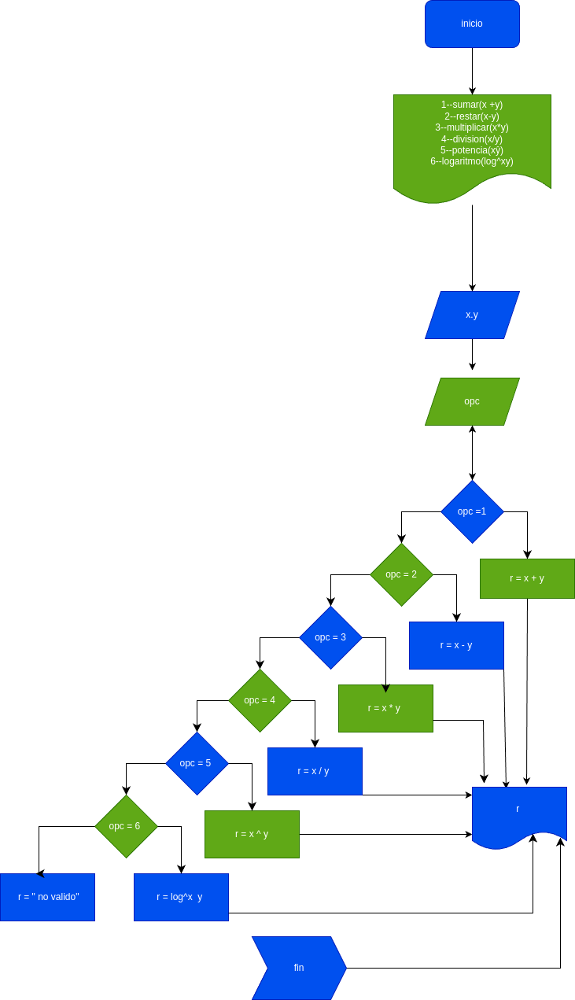

# minicalculadora
calculadora para hacer  operaciones basicas

# analisis
## input
### numero 
digite una operacion e indique el numero para indicar la operacion dada
- 1=suma
- 2=resta
- 3= multiplicacion 
- 4= division
- 5= potencia
- 6= logaritmo 
x = un valor
y = otro valor 

# prosessing
1 = x+y
2 = x-y
3 = x*y
4 = x/y
5 = xŷ
6 = logx y

# diseño

